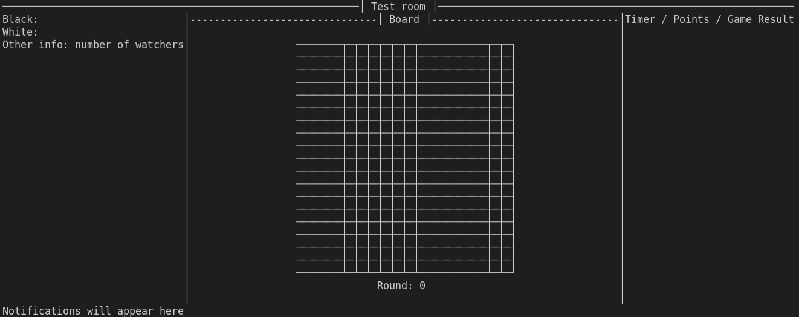

# GoOL - an online Go game client program written in Haskell
CSE230-final-project

## Members
Danling Wang

Pengfei Rao

Sicheng Wang

Tianyang Zhou

## UI features [Pengfei Rao, Danling Wang]
### Run the code
To run the current version, in your terminal under the root directory of this repo, run
```bash
cabal run
```
which should build and run the program in the current terminal. Currently, the UI should look something like this:


### Features that require coop from other parts
1. [Logic] move verification should return a result type including
   1. a Bool result
   2. a String describing the reason, which will be displayed on the notification panel


### drawing features
- [x] create seamless division of UI
- [x] use border to draw go board
- [x] find out how to draw go stone
- [ ] draw stone dynamically according to the stone state in the logic part
- [ ] Display score on the "game result" panel on the right
- [ ] Provide "Pass" button to the board and associate event handler to it
- [ ] Replace "Player 1" with "You (_color_)" and "Player 2" with "Opponent (_color_)"
- [ ] Provide Edit box for entering opponent's IP and buttons for connecting to opponents and listening for game requests
- [ ] (**Advanced**) Add "View history" feature to view previous moves and impacts (basically storing and displaying snapshots of the board for each valid move)

### events
- [x] redraw upon event, quit with events other then resize.
- [x] Get mouse position and translate them into the location of stones.


## Overview
We are going to develop a Go game online client program in Haskell. Using our client program, two players can be connected by network to play Go together in a gaming room, where the board and other related information will be shown in a command-line interface built by the Brick library. The software may allow others to join the gaming room and watch the live of the ongoing game, and in order to provide a better experience, onlookers who join halfway can review the game history step by step.

As the oldest board game continuously played to the present day, the Go game has many classic problems that people study to learn good strategies for playing. Our software provides the function for users to choose from a list of classic problems and use them as good practices for improving their Go game skills.

Considering the difficulty of the Go game, a standard 19 * 19 checkerboard may be too advanced for beginners. To help novices get started, we support changing the boards to different sizes.

## Program Structure
The program is based on 3 main modules:
1. Network communication
- Supports point-to-point communication between two players;
- Supports broadcast communication to watchers;
2. Logic judgement
- Stores and retrieves the current and historic state of the board (where each piece is placed);
- Supervises user actions according to the Go game rules;
3. UI system
- Visualizes the board and the pieces according to the outputs from the logic judgement module;
- Accepts mouse/keyboard input from players/watchers and forwards them to the judgement module;
- Visualizes username/ip address of players and watchers;

## Major Workflow
1. A user lays down a new piece by clicking on the visualized board.
2. The UI system receives the coordinates of the user's input and translates it into a position on the logic board.
3. Then the logic judgement module checks whether the user’s action is valid, and then sends its response to the UI module (if true, visualizes the piece and results; if false, displays the reason to the player) and the network module;
4. The network module sends the piece coordinate to the opponent. Then it waits for the input from the opponent;
5. The network module of the opponent receives the location input, and posts it to the logic module.
6. Then the logic judgement of the opponent also validates the move. Then, the UI module displays the result on the opponent’s screen, and then waits for input.
7. The software repeats steps 1 to 6 between the two players until the logic judgement module indicates that there is a winner or a tie.

## Update
### What is the architecture of your application (the key components)?
See the Program Structure part
### What challenges (if any) did you have so far and how did you solve them?
**Logit part**: 

How to deal with the Ko situation. When we find the prisoners, we  need to check whether it’s the Ko situation, if yes, label it, and need to unlabel it later. So the states of the go board not only contain BLACK, WHITRE, EMPTY but also KO.

**UI part**: 

How to render according to different board sizes.

Need information about the board to render correctly - Sync with the logic part to reach a consensus about what functions and values are needed.

**Network part**:

What data structure should be sent through the network.

How to keep the Socket connection.

Can a user be in receiving mode when other user sends it a message?(How to organize the logic inside every role in the system)
	
### Do you expect to meet your goals until the deadline?
**Logit part**: 

before 12.3 finish logit part, later cooperate with other teammates about the API.

**UI part**: 

split the tasks between two team members to make progress synchronously.

Clarified what UI components are needed and the actions attached to them.

**Network part**:

Should be finished in the ncoming two days because this is the basic part of multiple playing.

### If not, how will you modify your goals?
Finish goals with higher priority (build the MVP first before trying to realize additional features)

MVP includes:

**UI**:

renders the board, pieces on the board, player info, current score, and player IP

Handles user interactions and updates UI accordingly

**Logic**:

Makes changes to game data according to user actions

Passes necessary information (e.g. state of the game, score, etc.) to UI

**Network**:

Only support two players to play(not support observers)

**Additional features**:

Allows audiences to join the game room and watch the ongoing game

Allows audiences to see a history of moves made by the current players

**Stretch goals**:

Allows users to select from a series of classic Go game problems and play with themselves
